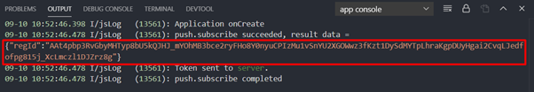
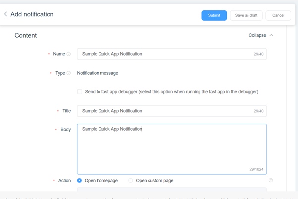
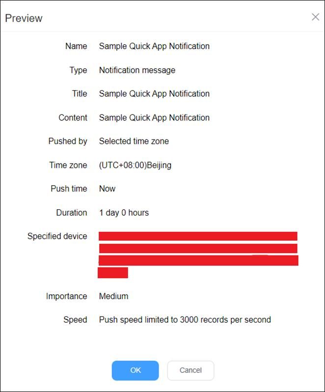
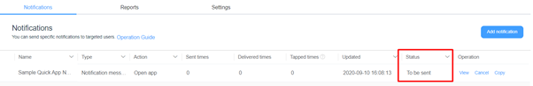
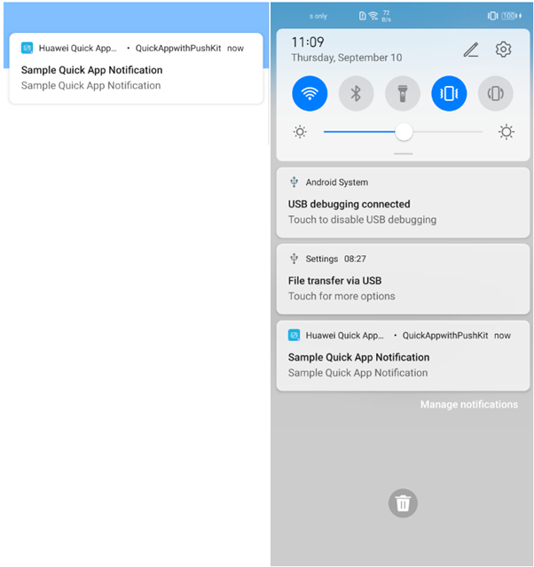

[^Note:]: Before sending push notification to the test device, the token must be created.

**Step 1:** Open QuickApp using with Huawei QuickApp IDE and copy “regId” from console. Need to use this token information when sending push notifications:

**Step 2:** Open AGC for sending Push notification AGC > My Projects > [Project-name] > Growing > Push Kit > Add Notification

[^Note]: If you want to test your QuickApp, don’t forget to select “Send to fast app debugger” option.

**Step 3:** After sending message, you can check the status of your notification:

**Step 4:** It can take 2-3 minutes for device/devices to receive the notification:

