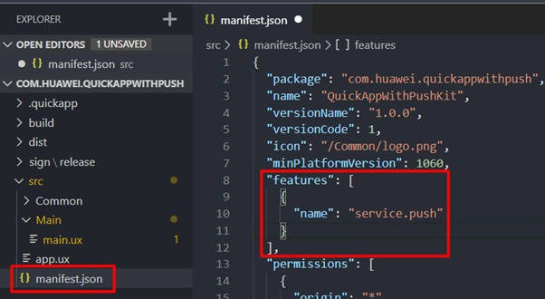
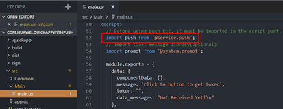
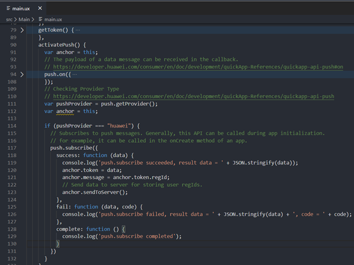

**Step 1:** Add the following configuration to the features attribute in the **manifest.json** file:

```javascript
{"name": "service.push"}
```



**Step 2:** Add the following configuration to the <script> on the page where the API will be called. You must add this to be able to use push functions on the page.

```javascript
import push from '@service.push'
```



**Step 3:** To send push notifications, you must have a token. In order to receive tokens, you must add the subscribe function to your application:

```javascript
push.subscribe({
    success: function(data) {
        console.log("push.subscribe succeeded, result data=" + JSON.stringify(data));
    },
    fail: function(data, code) {
        console.log("push.subscribe failed, result data=" + JSON.stringify(data) + ", code=" + code);
    },
    complete: function() {
        console.log("push.subscribe completed");
    }
});
```



