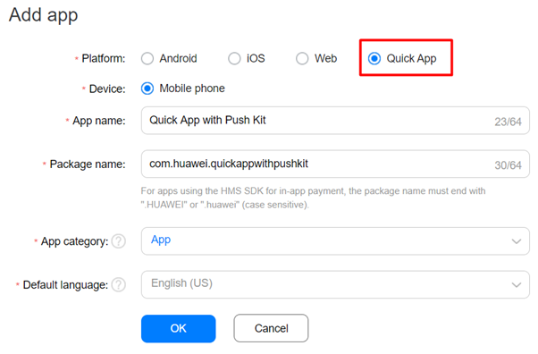
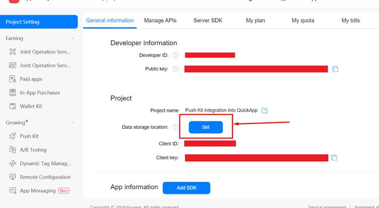
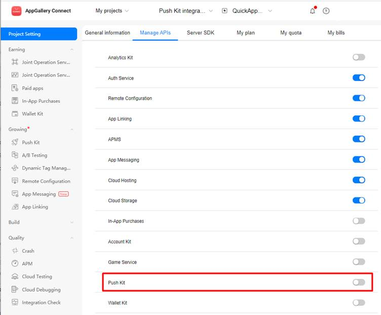
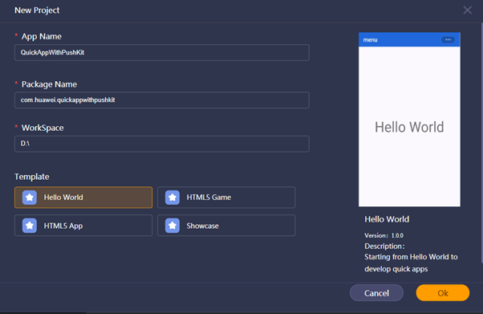
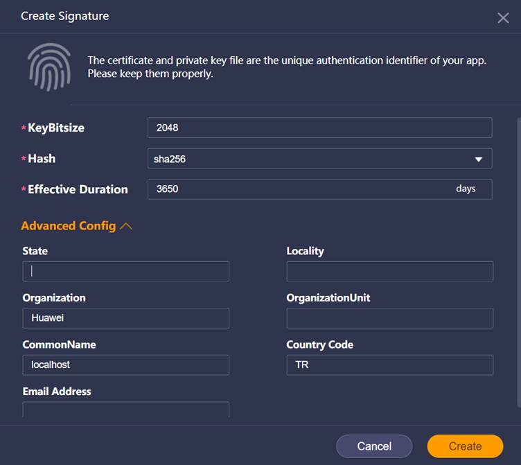
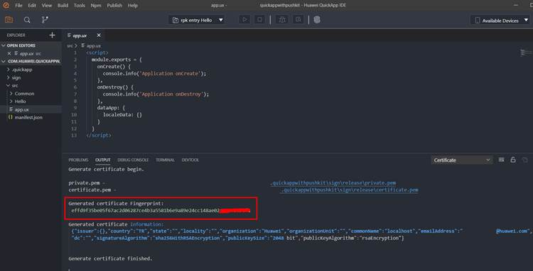
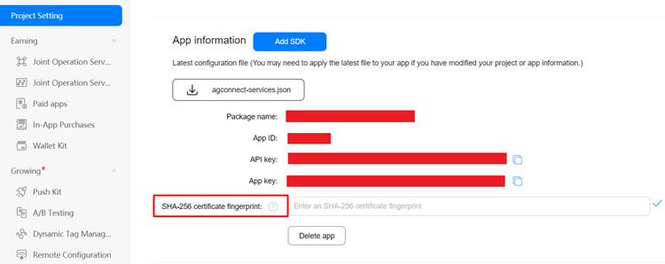

You can download the codelab project from [here](https://github.com/Natgho/Quick-App-with-HMS-Push-Kit).

**Step 1:** Create an app on AppGallery Connect. Don’t forget to select QuickApp option as the Platform type.

**Step 2: **Select data storage location.

**Step 3:** Enable Push Kit under project **Settings>Growing>Push Kit** then select your data storage location.

**Step 4:** Open the Huawei quick app IDE and go to **File** > **New project** > **New QuickApp Project**

**Step 5:** Create certificate for using AGC and integrating HMS Push Kit.

**Step 6:** Copy generated certificate fingerprint and paste it into your project settings page to AGC.

**Step 7:** Paste this generated fingerprint to Application certificate.

